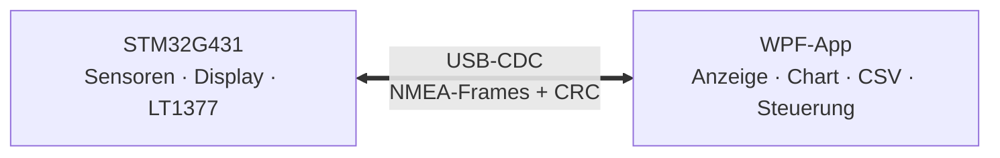
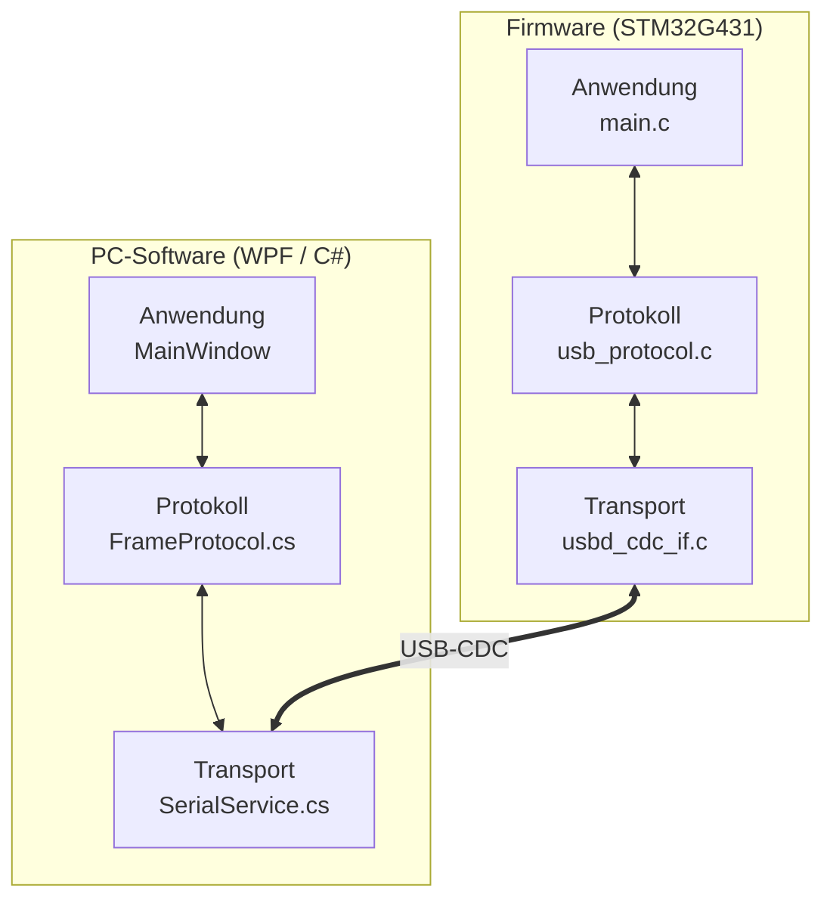
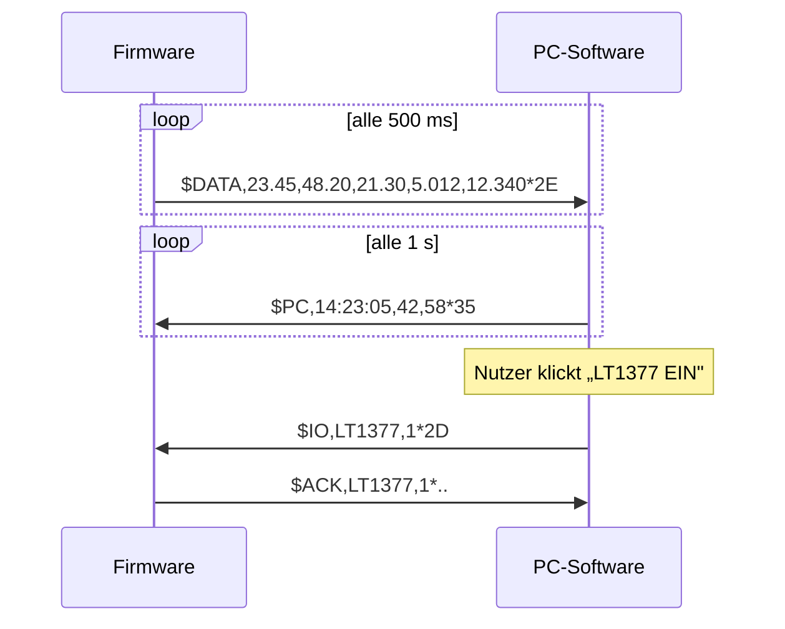
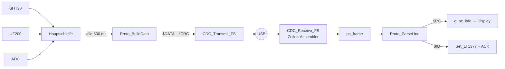
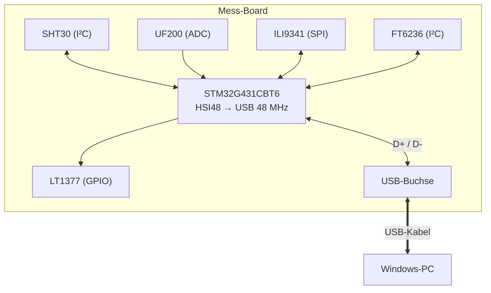

# USB Sensor & Control Bridge

> Kleines USB-Projekt — Abschluss der Mikrocontroller-Programmierung
> Yanik · BZTF · 2026

Bidirektionale Datenübertragung zwischen einem **STM32G431** und einem **PC** über USB-CDC, mit eigener PC-Software in **WPF (C#)**. Das Projekt erweitert das aus Auftrag 14 bekannte Mess-Board um eine echte zweiwege-USB-Kommunikation.



## Inhalt

- [1 Pflichtenheft](#1-pflichtenheft)
- [2 Zeitplanung & Arbeitsjournal](#2-zeitplanung--arbeitsjournal)
- [3 Software-Design](#3-software-design)
- [4 Firmware-Erweiterung gegenüber Auftrag 14](#4-firmware-erweiterung-gegenüber-auftrag-14)
- [5 Hardware-Design](#5-hardware-design)
- [6 Protokoll-Spezifikation](#6-protokoll-spezifikation)
- [7 Abschlusstest](#7-abschlusstest)
- [8 Schlusswort](#8-schlusswort)
- [Lieferumfang & Schnellstart](#lieferumfang--schnellstart)

---

# 1 Pflichtenheft

## 1.1 Projektziel

Eine **USB Sensor & Control Bridge**: Das Board sendet seine Messwerte zyklisch über USB-CDC an den PC, eine eigens entwickelte Windows-Anwendung (WPF, C#) zeigt sie live an, protokolliert sie auf Wunsch in eine CSV-Datei und steuert über dieselbe Verbindung Ausgänge des Boards.

## 1.2 Anforderungen

### Muss-Anforderungen

| ID | Anforderung |
|----|-------------|
| M1 | USB-Verbindung als **Virtual COM Port (CDC)** |
| M2 | Board sendet zyklisch alle Messwerte (SHT30 T/H, UF200 T, Vbat, Vsup) |
| M3 | **Eigene Windows-Anwendung** (kein Terminalprogramm) |
| M4 | PC sendet Daten, die auf dem **Display** erscheinen |
| M5 | **Checksumme** auf jedem Frame; fehlerhafte Frames verworfen |
| M6 | **Live-demonstrierbar** an der Präsentation |

### Soll-Anforderungen (Zusatzpunkte)

| ID | Anforderung |
|----|-------------|
| S1 | **Live-Chart** des Temperaturverlaufs |
| S2 | **CSV-Logger** mit Start/Stop |
| S3 | **LT1377 vom PC schaltbar** |
| S4 | **Auto-Reconnect** der Verbindung |
| S5 | Frame-Statistik (OK/Err-Zähler) in UI |
| S6 | Frame-Protokoll an Industriestandard (NMEA) angelehnt |

## 1.3 Abgrenzung

Kein Terminal-Modus, kein Audio-/HID-/Mass-Storage. Genau ein verbundenes Board.

---

# 2 Zeitplanung & Arbeitsjournal

| Datum | Lektionen | Planung | Ist | Ziel erreicht | Zeit |
|---|---|---|---|---|---|
| 06.02.2026 | 2 | Idee, Pflichtenheft, Architektur | _wird ausgefüllt_ | _j/n_ | _h_ |
| 20.02.2026 | 2 | Protokoll + FW-Frame-Builder/Parser | _wird ausgefüllt_ | _j/n_ | _h_ |
| 06.03.2026 | 2 | FW: zyklisches Senden + Empfang + IO | _wird ausgefüllt_ | _j/n_ | _h_ |
| 20.03.2026 | 2 | PC: WPF-Grundgerüst, SerialPort, Parser | _wird ausgefüllt_ | _j/n_ | _h_ |
| 27.03.2026 | 2 | PC: Chart, CSV, IO, Reconnect, E2E-Test | _wird ausgefüllt_ | _j/n_ | _h_ |
| 24.04.2026 | 2 | **Präsentation und Abgabe** | _wird ausgefüllt_ | _j/n_ | _h_ |

---

# 3 Software-Design

## 3.1 Gesamtarchitektur

Beide Seiten sind in drei Schichten unterteilt. Das Protokoll ist auf beiden Seiten **identisch implementiert** (gespiegelt), damit Builder und Parser bit-genau dasselbe tun.



## 3.2 Kommunikations-Sequenz



## 3.3 PC-Software (WPF) — Aufbau

Hauptfenster im Dark-Theme, drei Zonen:

```
┌────────────────────────────────────────────────────────────────────┐
│ Topbar: Status-LED · Port-Dropdown · Verbinden                     │
├──────────────────┬─────────────────────────────────────────────────┤
│ Messwerte (5×)   │ Live-Chart                                      │
│ Frame-Statistik  │ (SHT30 + UF200 Temperatur)                      │
├──────────────────┼──────────────────────┬──────────────────────────┤
│ LT1377 EIN/AUS   │ CSV-Logger Start/Stop│ PC → Board Checkbox      │
└──────────────────┴──────────────────────┴──────────────────────────┘
```

Wesentliche Klassen:

| Klasse | Zweck |
|---|---|
| `FrameProtocol` | Frame-Bau & -Parser inkl. XOR-Checksumme (gespiegelt zur FW) |
| `SerialService` | COM-Port, Zeilen-Assembler, **Auto-Reconnect**, Event-Marshalling auf UI-Thread |
| `CsvLogger` | CSV-Aufzeichnung mit sofortigem Flush |
| `TrendChart` | Selbst gezeichnetes Liniendiagramm (`OnRender` + Ringpuffer) |
| `PcInfoProvider` | Systemzeit, CPU-Last (PerformanceCounter), CPU-Temp (WMI, gecacht) |
| `MainWindow` | UI + Orchestrierung |

**Threading:** Das `SerialPort.DataReceived`-Event feuert auf einem Threadpool-Thread. `SerialService` marshallt deshalb alle Events per `Dispatcher.BeginInvoke` auf den UI-Thread — sonst gäbe es Cross-Thread-Exceptions.

---

# 4 Firmware-Erweiterung gegenüber Auftrag 14

Das Mess-Board war aus Auftrag 14 bereits mit Touch-Display, Sensoren und Versorgungsschaltung lauffähig. **USB-CDC war zwar eingerichtet, aber funktional ungenutzt** — der Empfang verwarf alle Daten, gesendet wurde nichts. Diese Lücke schliesst das Projekt.

## 4.1 Was war vorher schon da

- `main.c` mit Menü-State-Machine: Home, Temperature, Voltage, Settings (3 Buttons)
- Sensorauswertung SHT30 (I²C), UF200 (ADC), Spannungen Vbat/Vsupply (ADC)
- LT1377 Versorgung schaltbar über Settings-Menü
- ILI9341-Display + FT6236-Touch
- USB-CDC in der `.ioc` konfiguriert, HSI48-Clock aktiv
- `CDC_Receive_FS()`-Callback **leer** — Empfang wurde ignoriert

## 4.2 Was neu hinzugekommen ist

### Neue Dateien

| Datei | Inhalt |
|---|---|
| `Core/Inc/usb_protocol.h` | Protokoll-Definition, API für Frame-Bau und -Parser |
| `Core/Src/usb_protocol.c` | Implementierung: Frame-Builder, Parser, XOR-Checksumme |

### Geänderte Dateien

#### `USB_Device/App/usbd_cdc_if.c`

Der RX-Callback wurde von „verwirft alles" zu einem **Zeilen-Assembler** umgebaut. Eingehende Bytes werden gesammelt bis CR/LF, dann als kompletter Frame an die Anwendung übergeben:

```c
static int8_t CDC_Receive_FS(uint8_t* Buf, uint32_t *Len) {
    for (uint32_t i = 0; i < *Len; ++i) {
        char c = (char)Buf[i];
        if (c == '\r' || c == '\n') {
            if (line_idx > 0) {
                // Zeile komplett -> in pc_frame kopieren + Flag setzen
                ...
                pc_frame_ready = 1;
            }
        } else if (line_idx < CDC_FRAME_MAX - 1) {
            line_buf[line_idx++] = c;
        }
    }
    ...
}
```

#### `Core/Src/main.c`

| Neu | Was es bewirkt |
|---|---|
| `PC_MENU` im State-Enum | Neuer Display-Bildschirm für die vom PC empfangenen Werte |
| 4. Button „PC Data" im Home-Menü | Touch-Area, Layout von 3 auf 4 Buttons angepasst |
| `USB_SendData()` | Sendet alle 500 ms ein `$DATA`-Frame mit allen Messwerten |
| `USB_ProcessRxFrame()` | Wird in jeder Hauptschleifen-Iteration aufgerufen, parst empfangene Frames |
| `Set_LT1377(state)` | Schaltet die Versorgung definiert (nicht toggle), für PC-Befehle |
| `Dispaly_PC_MENU()` + `Update_Dispaly_PC_MENU()` | Zeichnen und Aktualisieren des PC-Menüs |
| Aufrufe in `while(1)` | `USB_ProcessRxFrame()` + `USB_SendData()` am Schleifenanfang |

### Datenfluss in der erweiterten Firmware



## 4.3 Was bewusst nicht angefasst wurde

- Die `.ioc`-Datei (USB war ja schon korrekt konfiguriert)
- Sensor-Treiber, Display-Treiber, Touch-Treiber
- Bestehende Menüs (Temperature, Voltage, Settings) — funktionieren unverändert weiter

Damit ist die Erweiterung **rückwärtskompatibel**: Wer das Board ohne USB benutzt, merkt nichts davon.

---

# 5 Hardware-Design



**USB-relevante Pins:** PA12 = USB_DP, PA11 = USB_DM. Der D+-Pull-up ist im G431-USB-Peripheral **intern** und wird durch `HAL_PCD_Start()` aktiviert — kein externer 1,5 kΩ-Widerstand nötig.

---

# 6 Protokoll-Spezifikation

Das Protokoll ist an **NMEA 0183** angelehnt: textbasiert, mit XOR-Checksumme abgesichert, damit gut debugbar und gleichzeitig robust.

## 6.1 Frame-Format

```
$<TYPE>,<feld1>,<feld2>,...*<CRC>\r\n
```

`CRC` = XOR aller Zeichen zwischen `$` und `*`, als 2-stelliger Hex.

```c
uint8_t Proto_Checksum(const char *data, uint16_t len) {
    uint8_t cs = 0;
    for (uint16_t i = 0; i < len; ++i) cs ^= (uint8_t)data[i];
    return cs;
}
```

Auf der PC-Seite identisch in `FrameProtocol.cs`.

## 6.2 Frame-Typen

| Richtung | Frame | Beispiel |
|----------|-------|----------|
| µC → PC | `$DATA,shtT,shtH,ufT,vbat,vsup` | `$DATA,23.45,48.20,21.30,5.012,12.340*2E` |
| µC → PC | `$ACK,<name>,<0\|1>` | `$ACK,LT1377,1*..` |
| PC → µC | `$PC,<hh:mm:ss>,<load>,<temp>` | `$PC,14:23:05,42,58*35` |
| PC → µC | `$IO,<name>,<0\|1>` | `$IO,LT1377,1*2D` |

## 6.3 Robustheit & Verifikation

Frames werden verworfen bei: falschem Start (`$`), fehlendem `*`, ungültigem CRC-Hex, **falscher Checksumme**. Die Zähler `g_frames_ok` / `g_frames_err` sind in der UI sichtbar — manipulierte Frames lassen sich damit live demonstrieren.

| Test | Ergebnis |
|---|---|
| `$DATA` bauen → CRC = `2E` | ✓ |
| `$PC`-Frame parsen → `14:23:05, 42, 58` | ✓ |
| `$IO,LT1377,1` parsen | ✓ |
| **Manipulierte CRC → verworfen** | ✓ |

---

# 7 Abschlusstest

## 7.1 Muss-Anforderungen

| ID | Anforderung | Status |
|----|-------------|--------|
| M1 | USB-CDC als Virtual COM Port | ✅ |
| M2 | Zyklisches Senden ≥ 1 Hz | ✅ (alle 500 ms) |
| M3 | Eigenes Windows-Programm | ✅ (WPF) |
| M4 | PC-Daten am Display | ✅ (Menü „PC DATA") |
| M5 | CRC + Verwerfen fehlerhafter Frames | ✅ |
| M6 | Live-Demonstration | ✅ |

## 7.2 Soll-Anforderungen

| ID | Anforderung | Status |
|----|-------------|--------|
| S1 | Live-Chart | ✅ |
| S2 | CSV-Logger | ✅ |
| S3 | LT1377 vom PC schaltbar | ✅ |
| S4 | Auto-Reconnect | ✅ |
| S5 | Frame-Statistik in UI | ✅ |
| S6 | NMEA-Industriestandard | ✅ |

## 7.3 Bekannte Einschränkungen

CPU-Temperatur (Kann-Anforderung) wird über WMI gelesen und ist mainboard-abhängig. Ist sie nicht verfügbar, sendet die PC-Software `-1` und das Display zeigt `--`. CPU-Last funktioniert auf jedem Windows-PC.

**Gesamt: Muss 6/6 · Soll 6/6 · Pflichtanforderungen vollständig erfüllt.**

---
# 8 Schlusswort

Dieses Projekt wurde innerhalb weniger Tage erfolgreich umgesetzt und abgeschlossen. Leider konnte das ursprünglich geplante Projekt nicht vollständig fertiggestellt werden. Dennoch ist diese Umsetzung eine gelungene Anbindung und Erweiterung meiner Probe-IPA-Arbeit.


---

# Lieferumfang & Schnellstart

| Datei | Inhalt |
|---|---|
| `CubeIDE_SW_TEMP_V1.zip` | komplettes STM32CubeIDE-Projekt (Firmware) |
| `WpfApp1_complete.zip` | komplettes Visual-Studio-Projekt (PC-Software) |

1. CubeIDE-Zip importieren → **Build** → **Flash**
2. WpfApp1-Zip entpacken → `WpfApp1.sln` in Visual Studio öffnen → **F5**
3. Board per USB anstecken → COM-Port wählen → **Verbinden**
